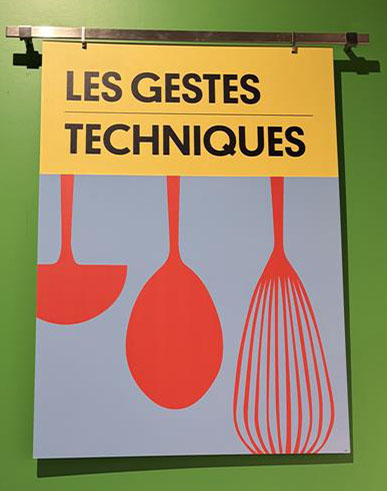
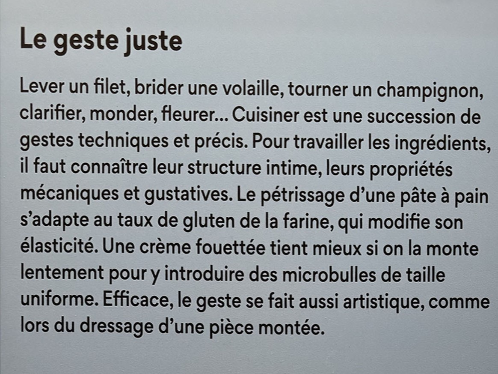
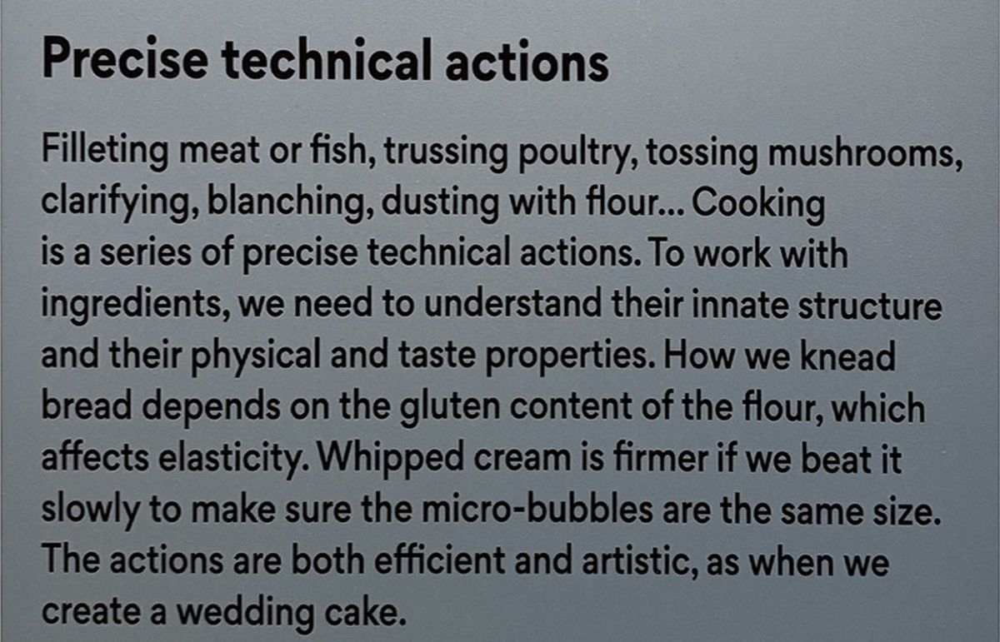
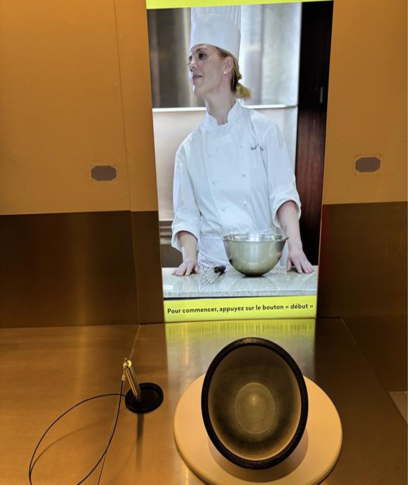

# Centre des sciences
### Type d'exposition: temporaire
----------------------

## Description: Les gestes techniques
-------------
Il y a un écran avec une video d’une madame qui nous explique la technique pour brasser la crème jusqu’à ce qu'elle devient solid. Par la suite, on est intégré dans l’experience. C'est-à-dire que c'était à mon tour pour brasser dans le bol. Évidemment, il n'y avait pas de crème dedans. Mais lorsque je brassais dans le bol, le font est surement équippé d’un senseur qui détecte mon mouvement circulaire et c’est tres intéressant, car je peux voir mon brassage sur l'écran.

  

## Voici des vidéos de mon expérience:
https://youtube.com/shorts/ru2syq00gMw?feature=share
https://youtube.com/shorts/Y9c0AqjYx9Q?feature=share
https://youtube.com/shorts/UNLjkMNhvcU?feature=share

## L'assemble de l'oeuvre:

## Composantes et techniques:
-Écran
-Un brasseur avec un file attaché en bas
-Un bol équippé avec un senseur
-Un boutton <<Start/Débuter>>

## Ce qui m'a plu le plus:
J'ai vraiment aimé l'expérience de préparer la crème. Ce qui m'a le plus marqué, c'est que j'avais l'impression d'être réellement en train de la brasser moi-même.  C'était comme si la texture, les mouvements et même les sons étaient exactement ceux d'une vraie fabrication de crème. 

## Ce que je changerais:
Globalement, l'oeuvre est amusante. Le seul problème que j'avais c'était que je n'entendais pas assez ce que la madame dams la vidéo disait. Donc, si cela était mon oeuvre, je m'aurais assurer que le volume est assez fort pour les visiteurs qui viennent expérimenter.

### Autres:
Date de visite: 31 Janvier 2025 
Année de réalisation: 2021
