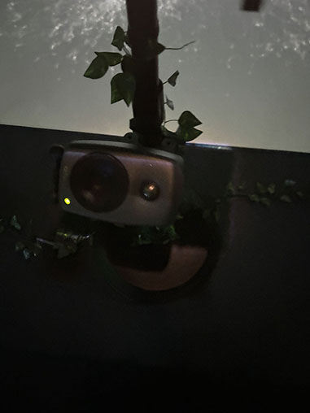
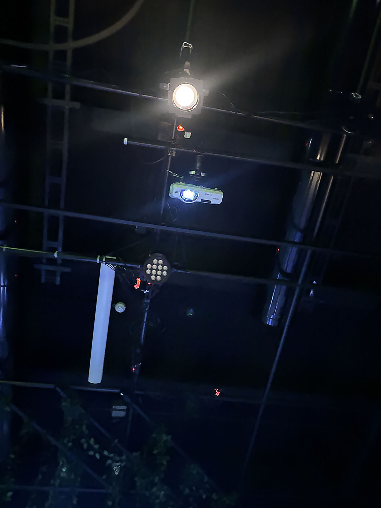

# L'exposition des finissants #
### Mon préféré: Luminatura ###

  
Voici un lien vers une vidéo explicative de Luminatura: https://youtu.be/i6xJno_NFSc

Voici un lien vers une vidéo demonstrative: https://youtube.com/shorts/1kCxPRZF66o?feature=share
https://youtube.com/shorts/Y906fyyebAM?feature=share
-----------------------------------
## Description ##
Luminatura est un projet multimédia des finissants qui fusionne la nature et la technologie. Son objectif principal est d'explorer l'interaction entre la nature et les humains à travers le capacitance. Pour ceux qui ne savent pas c'est quoi vous pouvez cliquez ici: https://en.wikipedia.org/wiki/Capacitance#:~:text=Capacitance%20is%20the%20ability%20of,self%20capacitance%20and%20mutual%20capacitance.

## Définition ##
Un phénomène physique qui permet de stocker et de transférer de l'énergie. À travers des installations immersives, Luminatura invite les participants à entrer en contact direct avec des éléments naturels tout en interagissant avec des dispositifs technologiques qui réagissent à la capacité de leur propre corps à conduire l'énergie.

Pour ce projet, ils se sont inspiré des lumières captivante de forest of resonating lamps one stroke ainsi que de l'oeuvre pulse room par Rafael Lozano Hemmer: https://www.teamlab.art/w/forest_of_resonating_lamps/
https://www.lozano-hemmer.com/pulse_room.php

Dans cette image, vous pouvez voir une tablette noir. Grâce à cette tablette, nous, les participants, avons la possibilité d'illuminer les plantes de différentes couleurs. En effet, chaque fois que nous touchons la tablette, elle envoie un signal qui envoie surement un message au projecteur qui lui fait en sorte que les plantes s'illument de couleurs différentes.

À côté des éléments visuels et des objets exposés, il y a aussi l'aspect sensorielle . Un petit haut-parleur, probablement relié à un logiciel spécialement conçu comme Reaper, diffuse un son enveloppant, qui semble reproduire les bruits, les voix ou les ambiances de l'époque ou de la situation décrite.

 Ce son amplifie la connexion émotionnelle, renforçant l'intensité de l'expérience. En synchronisation avec ce son, un projecteur illumine l’espace de couleurs, créant une atmosphère visuelle en constante progression.
 

## Liens vers d'autres projets ##

https://youtube.com/shorts/ExrjkvTPhsw?feature=share

https://youtube.com/shorts/FMZVu0R0xGc?feature=share

https://youtube.com/shorts/H4ZAFMYzsOs?feature=share

https://youtube.com/shorts/7YESDI9VcPw?feature=share

https://youtube.com/shorts/WynPxKmEwmg?feature=share
