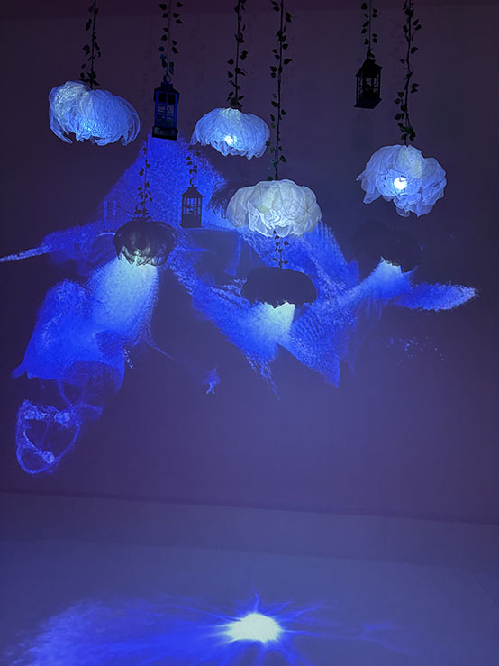

# Toutes les projets #

## 1: Luminatura ##
### Créateurs/Créatrices: ###
 Directrice Artistique: Camilia Bouatmani

 Programmeuse Administratrice du projet: Prethiah Rajaratnam

 Directrice Audio Visuel Gstionnaire du projet: Audrey Dandurand

 Programmeuse Coordonnatrice des medias: Justine Rousseau

 Développeur interactif: Ihab Mouhajer

Voici un lien vers le schéma d'installation:
https://miaou-mafia.github.io/projet-luminatura/#/20_intention/40_scenarimage/

 

## 2: Etheria ##
### Créateurs/Créatrices: ###
 Compositeur Sonore, programmeur: Maik Hamel

 Programmeur, Artiste VFX/ Design: Machael Un Dupré

 Programmeur, Artiste VFX/ Design, Artiste 3D: Pierre-Luc Proulx

 Programmeur, Artiste Design: Victor Gileau

 Monteur Vidéo, Artiste Design, programmeur: Joshua Gonzalez Barrera

Voici un lien vers le schéma d'installation:
https://ethereal-creators.github.io/Etheria/#/20_intention/40_scenarimage/

# 3: Prismatica #
Développeur interactif: Vincent Delisle

Directeur artistique: Jérémy Duverseau

Chargée du projet: Ikrame Rata

Voici un lien vers le schéma d'installation:
https://pootpookies.github.io/Prismatica/#/20_intention/40_scenarimage/

# 4: Fuga #

 Directeur visuel: Daniel Dezmma

Directeur sonore: Tristan Khadka

Programmeur: Abdel ALi Djeral

Voici un lien vers le schéma d'installation:
https://escapism-fuga.github.io/Fuga/#/20_intention/40_scenarimage/

# 5: Internature #

Responsable de la gestion des ressources techniques, mapping vidéo, Conception sonore Sitmonternna Yi

Gestion de l'organisation du projet, visuels, programmateuse de l'interactivité : Delphine Grenier

 Responsable de la communication entre le numérique et le réel, programmeur :Isaac

 Directeuse artistique, conception sonore :Kenza El Harrif
 
 Design visuel, chargée du projet, programmateuse de lumière :Khaly Tia Sing

 Voici un lien vers le schéma d'installation:
https://tprangers.github.io/internature/#/20_intention/40_scenarimage/

# 6: CONDU U8 #
Designer de niveaux: Ian Corbin

Programmeur des méchanismes: Alexandre Gervais

Programmeur interconnectivité: Jérémy Roy-Côté

Responsable du développement technique: Kreven Malric

Directeur artistiqueL Samuel Desmeules-Voyer

Voici un lien vers le schéma d'installation:
https://gearshift-games.github.io/Web-C0N-DU8/#/20_intention/40_scenarimage/

# 7: Arcadia #
Conception sonore: Dominic Yale

Conception visuelle: William Beauvais

Programmation: Anton Nikulin

Voici un lien vers le schéma d'installation:
https://cousi-cousa.github.io/Arcadia/#/20_intention/40_scenarimage/

