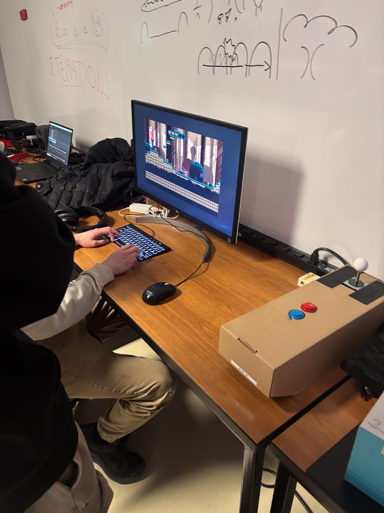

# Toutes les projets #

## 1: Luminatura ##
### Créateurs/Créatrices: ###
 Directrice Artistique: Camilia Bouatmani

 Programmeuse Administratrice du projet: Prethiah Rajaratnam

 Directrice Audio Visuel Gstionnaire du projet: Audrey Dandurand

 Programmeuse Coordonnatrice des medias: Justine Rousseau

 Développeur interactif: Ihab Mouhajer

Voici un lien vers le schéma d'installation:
https://miaou-mafia.github.io/projet-luminatura/#/50_diffusion/?id=documentation-vid%c3%a9o-de-l39installation-en-action
https://miaou-mafia.github.io/projet-luminatura/#/20_intention/40_scenarimage/

 

## Mon expérience ##

Lors de mon expérience, j'avais l'impression de prendre en main la nature elle-même, la guidant pour qu'elle exprime des émotions profondes à travers l'expérience remplit de couleurs. Ce projet était très captivant d'observer les résultats. Ce qui m'a particulièrement marqué et que j'ai le plus apprécié, c'est les couleurs elles m'ont transmis une liste d'émotions, de la tranquillité, en passant par la mélancolie, comme si chaque teinte possédait leur propre voix.

## 2: Etheria ##
### Créateurs/Créatrices: ###
 Compositeur Sonore, programmeur: Maik Hamel

 Programmeur, Artiste VFX/ Design: Machael Un Dupré

 Programmeur, Artiste VFX/ Design, Artiste 3D: Pierre-Luc Proulx

 Programmeur, Artiste Design: Victor Gileau

 Monteur Vidéo, Artiste Design, programmeur: Joshua Gonzalez Barrera

Voici un lien vers le schéma d'installation:
https://ethereal-creators.github.io/Etheria/#/50_diffusion/?id=documentation-du-projet-finalis%c3%a9
https://ethereal-creators.github.io/Etheria/#/20_intention/40_scenarimage/

 
https://youtube.com/shorts/FMZVu0R0xGc?si=V1Va9qO84JHln_YJ

## Mon expérience ##

Lors de mon expérience, je me suis vraiment bien amusé. C'était un type de jeu qui m'a vraiment plongé dans une dynamique fascinante. Ce qui m'a particulièrement intrigué, c'est que ce n'était pas seulement un jeu, mais un défi où on devait défendre quelque chose au centre du jeux. Le but du jeu, avec ses mécanismes subtils et ses surprises, m'a poussé à être compétitif , à tester des stratégies et à m'immerger pleinement dans son univers. C'était une expérience qui ne se contentait pas seulement d'être divertissante, mais elle était aussi profondément engageante et stimulante.

# 3: Prismatica #
Développeur interactif: Vincent Delisle

Directeur artistique: Jérémy Duverseau

Chargée du projet: Ikrame Rata

Voici un lien vers le schéma d'installation:
https://pootpookies.github.io/Prismatica/#/50_diffusion/?id=diffusion
https://pootpookies.github.io/Prismatica/#/20_intention/40_scenarimage/

 
https://youtube.com/shorts/ExrjkvTPhsw?si=xLNcVQjBLt0wrYhi

## Mon expérience ##

Lors de mon expérience, je n'ai pas vraiment ressenti ce moment "wow" que j'attendais. Cependant, j'ai malgré tout apprécié y participer, car elle m'a permis d'explorer un projet qui avait sa propre singularité. J'ai trouvé intéressant de découvrir un projet de finissant qui, à sa manière, se distinguait des autres.

# 4: Fuga #

 Directeur visuel: Daniel Dezmma

Directeur sonore: Tristan Khadka

Programmeur: Abdel ALi Djeral

Voici un lien vers le schéma d'installation:
https://escapism-fuga.github.io/Fuga/#/50_diffusion/?id=diffusion
https://escapism-fuga.github.io/Fuga/#/20_intention/40_scenarimage/

 
https://youtube.com/shorts/FMZVu0R0xGc?si=GxBrFpbq38IMPz9v

## Mon expérience ##

Lors de mon expérience, encore ça m'a pas trop intéressé si on le compare aux autres projets comme Luminatura ou Etheria, mais quand même j'ai apprécié l'intégration de la nature et la créativité du projet.

# 5: Internature #

Responsable de la gestion des ressources techniques, mapping vidéo, Conception sonore Sitmonternna Yi

Gestion de l'organisation du projet, visuels, programmateuse de l'interactivité : Delphine Grenier

 Responsable de la communication entre le numérique et le réel, programmeur :Isaac

 Directeuse artistique, conception sonore :Kenza El Harrif
 
 Design visuel, chargée du projet, programmateuse de lumière :Khaly Tia Sing

 Voici un lien vers le schéma d'installation:
 https://tprangers.github.io/internature/#/50_diffusion/?id=diffusion
https://tprangers.github.io/internature/#/20_intention/40_scenarimage/

https://youtube.com/shorts/H4ZAFMYzsOs?si=WaruRasuLK9BcS7i

## Mon expérience ##

Lors de mon expérience, j'ai ressenti comme si j'étais transporté dans une mini grotte, un espace intime et captivant, où l'atmosphère était à la fois vive et vibrante. Les couleurs, éclatantes et dynamiques, semblaient se mêler à l'environnement, créant une ambiance presque magique si on peut se permettre de dire.

# 6: CONDU U8 #
Designer de niveaux: Ian Corbin

Programmeur des méchanismes: Alexandre Gervais

Programmeur interconnectivité: Jérémy Roy-Côté

Responsable du développement technique: Kreven Malric

Directeur artistiqueL Samuel Desmeules-Voyer

Voici un lien vers le schéma d'installation:
https://gearshift-games.github.io/Web-C0N-DU8/#/50_diffusion/?id=diffusion
https://gearshift-games.github.io/Web-C0N-DU8/#/20_intention/40_scenarimage/

 
https://youtube.com/shorts/7YESDI9VcPw?si=AVXaL5icgryZqSj2

## Mon expérience ##

Lors de mon expérience, j'ai ressenti une sensation similaire à celle que je ressens lorsque je vais au gym et que je m'entraîne. Chaque moment m'engageait physiquement et mentalement, demandant un effort et une concentration soutenus. Tout comme l'adrénaline et la satisfaction que l'on éprouve après une bonne séance d'entraînement, cette expérience m'a procuré un sentiment d'accomplissement.

# 7: Arcadia #
Conception sonore: Dominic Yale

Conception visuelle: William Beauvais

Programmation: Anton Nikulin

Voici un lien vers le schéma d'installation:
https://cousi-cousa.github.io/Arcadia/#/50_diffusion/?id=diffusion
https://cousi-cousa.github.io/Arcadia/#/20_intention/40_scenarimage/

 

## Mon expérience ##

Lors de mon expérience, je n'ai pas ressenti d'émotion marquante en général. C'était une expérience qui m'a semblé assez neutre, et je l'ai joué un peu comme un autre jeu vidéo. Bien que l'aspect interactif ait été intéressant, je n'ai pas vécu de moments particulièrement captivants ou émouvants qui m'auraient vraiment marqué.

# Trois cours nécessaires: #

1: Modélisation 3D
2: Traitement audiovisuel
3: Réalité mixte

