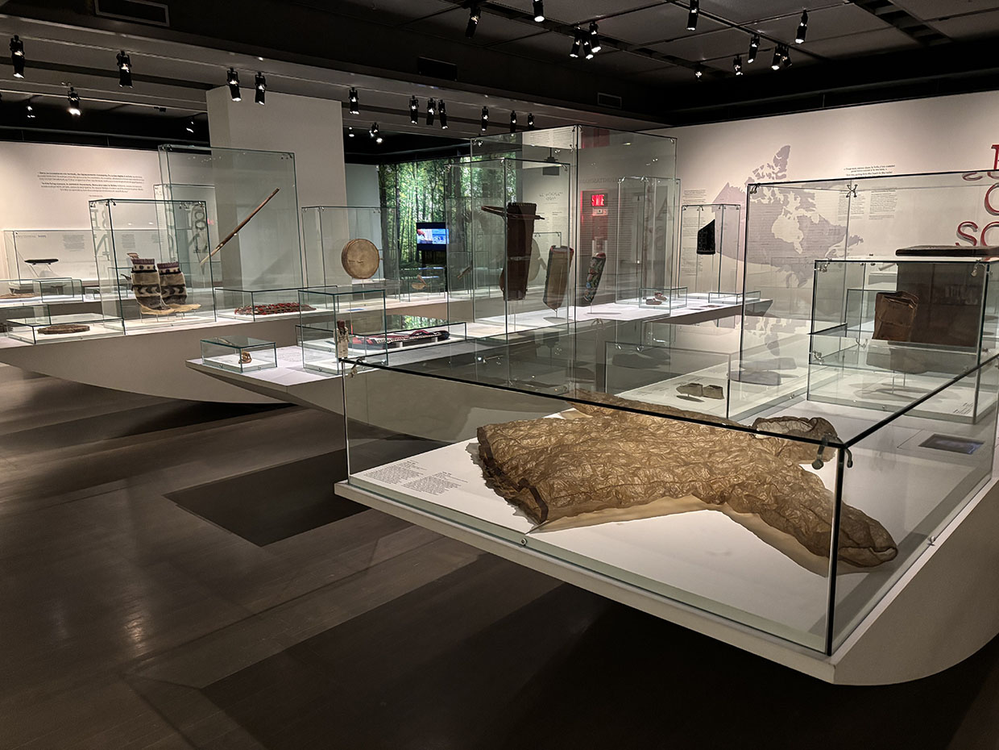
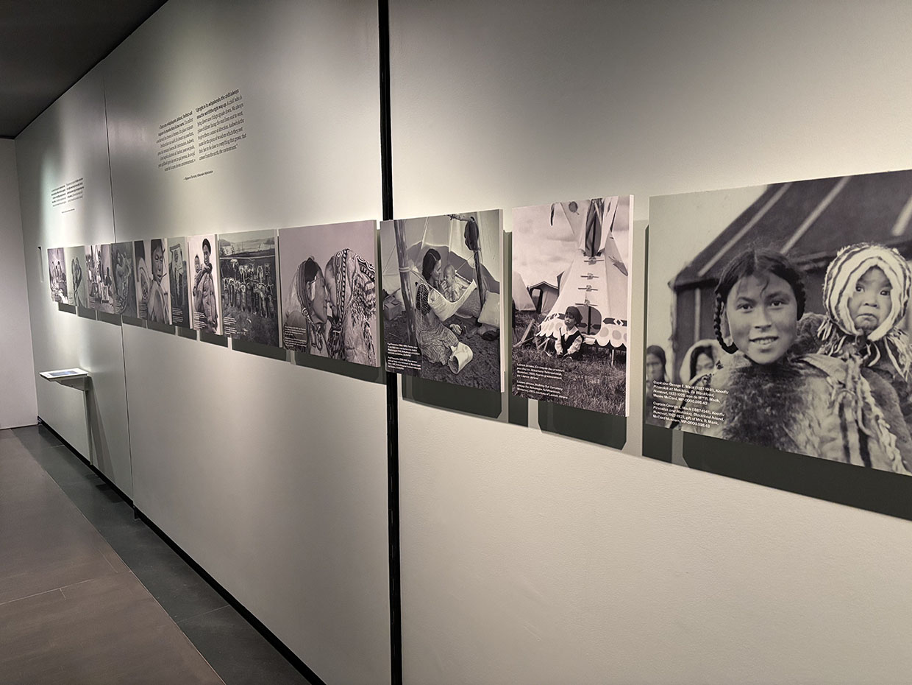
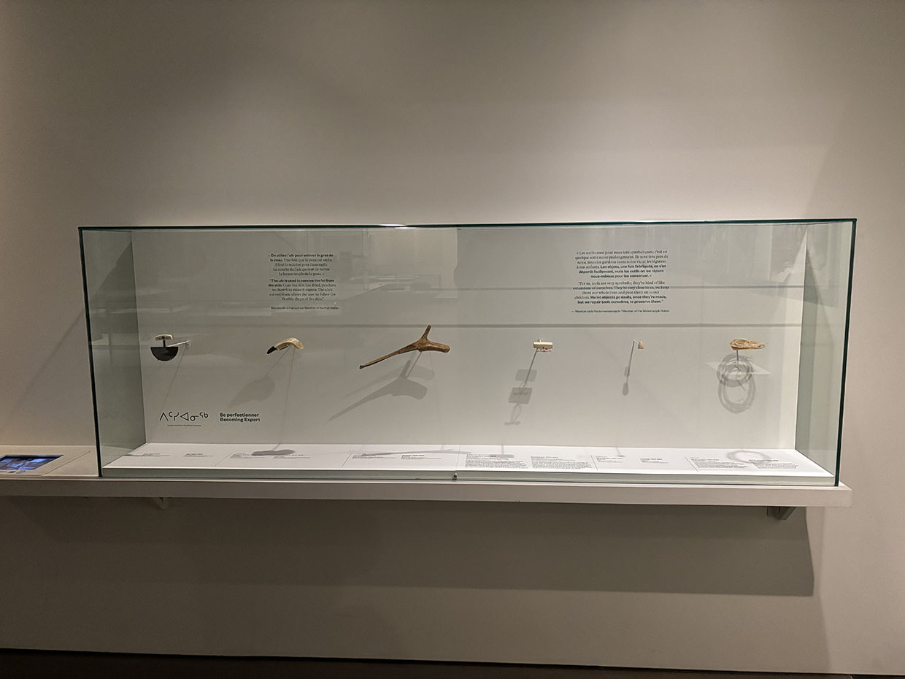
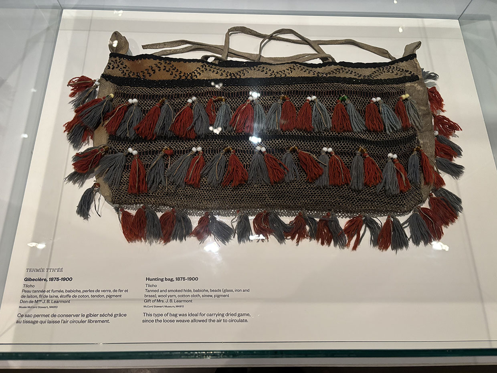
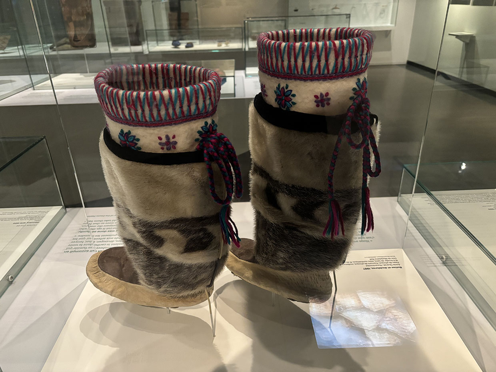
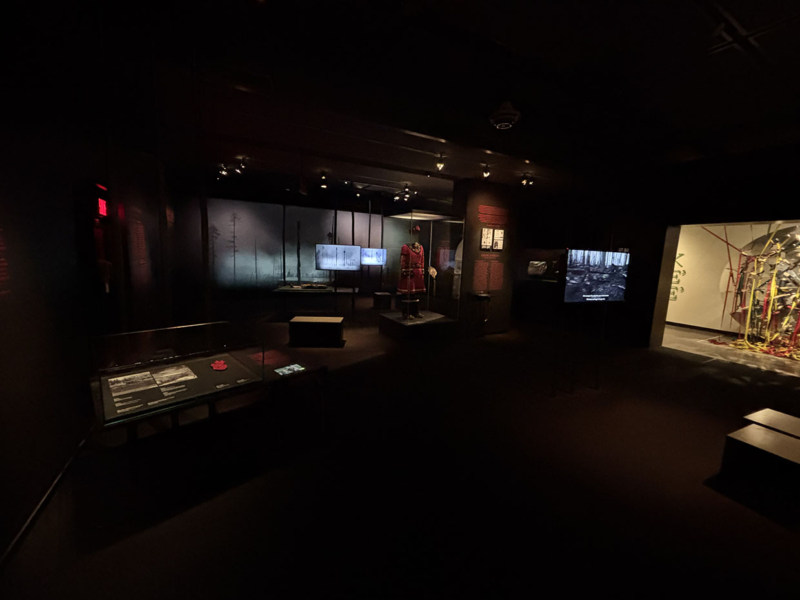
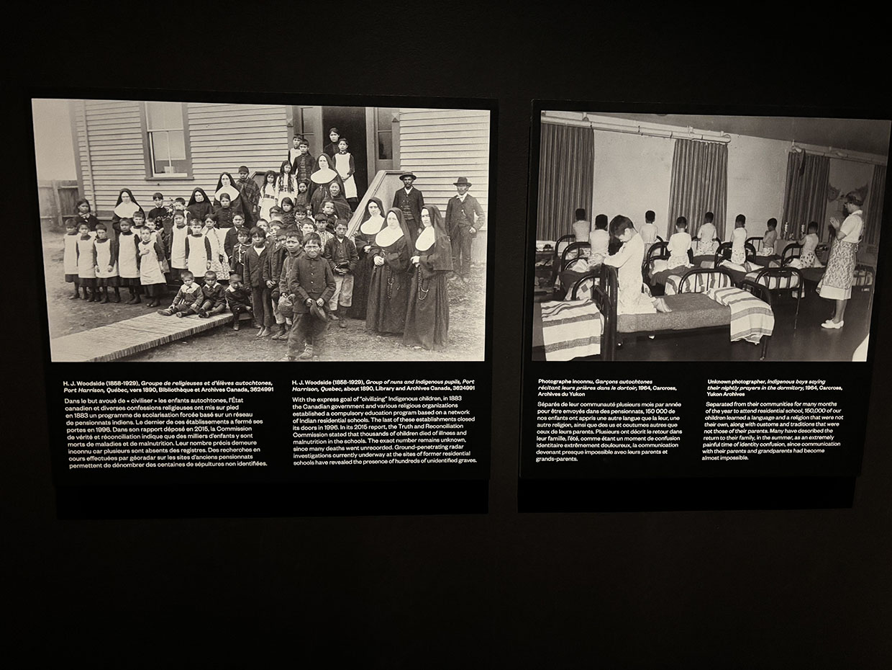
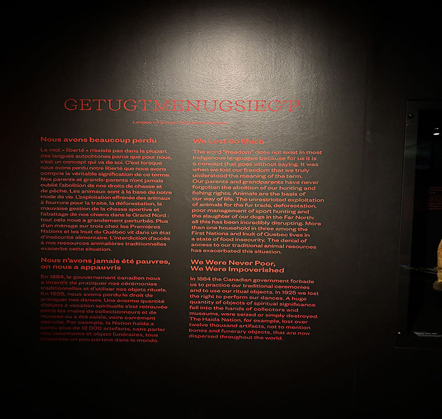
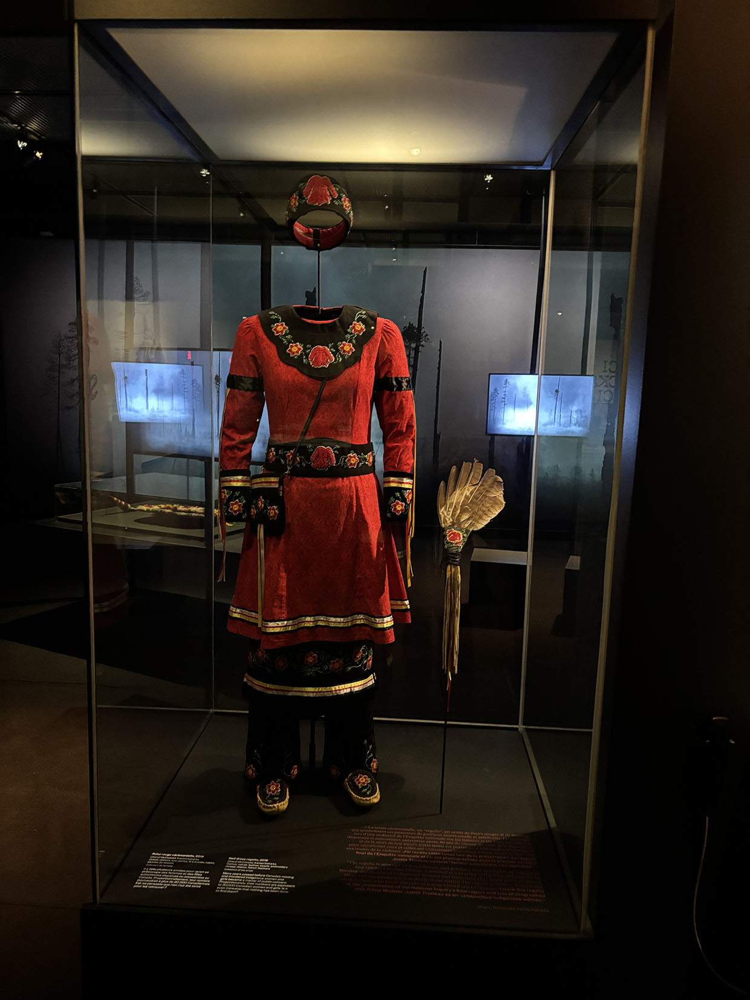

# La Voix Autochtone #

Voici une vidéo qui montre le tout: https://youtu.be/85LtbCPoTzk?si=y_BCXRsC-Dnafb5q

 Dès que j’ai vu La voix des autochtones dans la liste, je l’ai choisi parce que je sais qu’ils ont traversé beaucoup de choses et que leur culture est tellement riche. Je ne sais pas pour vous , mais je trouve que leurs histoires sont intéressantes et tristes mais aussi inspirantes.

Voici une vidéo de l'entrer:
https://youtu.be/v8Xr8mjKujw

 ## Section 1: Les matériaux ##

Dans la première section de l'exposition, l'accent était mis sur les matériaux utilisés dans la conception des équipements. Des textiles techniques et des matériaux résistants étaient mis en avant, expliquant comment ils contribuent à la performance et au confort dans des environnements extrêmes. Des vêtements spécialement conçus pour la protection.

 

Les visiteurs pouvaient interagir avec une série de cartes qui mettaient en évidence les trajets ou les zones où ces matériaux sont utilisés. Des tablettes tactiles étaient disposées tout autour, permettant de visionner des vidéos en boucle qui expliquaient non seulement l’utilisation de l’équipement, mais aussi les processus de fabrication et les avantages de chaque innovation.

 

 

 

 

Voici une vidéo qui montre quelques outils plus proche: [https://youtu.be/4KyvwU42QQ0](https://youtube.com/shorts/4KyvwU42QQ0?feature=share)

 ## Section 2: Leur souffrance ##

 Dans la deuxième section de l'exposition, le ton devient plus sombre , mettant en lumière les souffrances vécues par cette nation. Les tragédies de parents qui ont vu leurs enfants leur être arrachés, emportés dans un contexte de persécution systématique. 
 
  

Les visiteurs peuvent lire et regarder des témoignages poignants sur la manière dont cette communauté a été déshumanisée et haïe, simplement en raison de son identité, de ses croyances et de sa culture. Les vidéos et les documents exposés témoignent de la dureté de la vie quotidienne, marquée par la violence, la pauvreté et une haine persistante, souvent exacerbée par des préjugés culturels et politiques.

  

  

Des objets symboliques comme des masques traditionnels sont présentés our donner un aperçu de la résistance culturelle et spirituelle face à l'oppression. Ces masques, portés autrefois lors de rituels et de cérémonies, étaient bien plus que de simples accessoires. Ils représentaient des symboles d'identité et de dignité dans un monde qui tentait de les effacer. Leurs formes, matériaux et décorations racontent l’histoire d’un peuple qui a su préserver ses racines malgré l’adversité. À travers ces objets, on perçoit l'espoir de résilience et la volonté de survie au milieu de la violence et de la répression.

 

 ## Section 3: L'harmonie qui vient avec l'alliance ##

Dans la dernière section, rassemble et met en lumière l'idée d'union, de paix, d'harmonie et comment on peut faire pour guérir du passé.
 Elle met en valeur leurs efforts pour restaurer la santé et le bien-être, perturbés par les politiques d’assimilation historiques, en partageant leurs histoires, leurs rêves et leurs visions pour un avenir meilleur. Cette partie conclue de l’exposition invite les visiteurs à s’engager dans un dialogue significatif.

