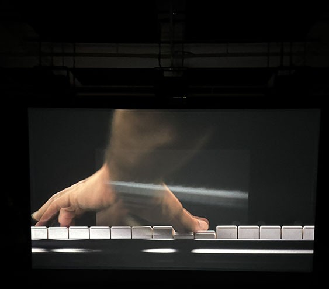

# Ravel Ravel interval #
## Une exposition temporaire: jusqu'au 27 Avril ##

 
-----------------------------
Ravel Ravel interval est un oeuvre fait par Anri Sala un albano-français. Les mains vue des les images appartiennent à Louis Lortie. En gros, l'oeuvre a était créer pour un pianiste nommée Paul Wittgenstein qui avait perdu sa main droite durant la Première Guerre mondiale. Cela explique pourquoi nous voyons seulement la main gauche sur les écrans.

#### Le projecteur ####
 

L’installation comprend deux écrans illustrant les vidéos de près par des projecteurs qui montrent les performances du pianiste et un système d'audio d'haut-parleur disperçé un peu partout dans la salle (installation sonore à 14 canaux). Elle crée un espace sensoriel où les visiteurs peuvent ressentir la tension émotionnelle peu importe où ils sont dans la pièce. Dernièrement, il y avait des places pour s'asseoir.

#### Les principaux haut-parleurs ####
 

La salle est conçue pour plonger les spectateurs dans un environnement sensoriel, les invitant à circuler librement pour expérimenter différents points de vue et perspectives sonores. Grâce à l'absence de décor, nous pouvons complètement concentrer l’attention sur les vidéos et les sons.

 

Voici un lien vers la page web: https://www.mbam.qc.ca/fr/expositions/anri-sala/

J'ai fais un peu plus de recherche et j'ai trouvé une vidéo de Louis Lortie qui parle de la pièce.
Voici le lien vers la vidéo: https://youtu.be/8GIjffOPR_4?si=9phXlXO2Lv1JNErs

### Signification ###
Le titre Ravel Ravel Interval est un jeux de mot du nom du compositeur et le terme "intervalle", soulignant le décalage temporel et spatial entre les deux interprétations.

