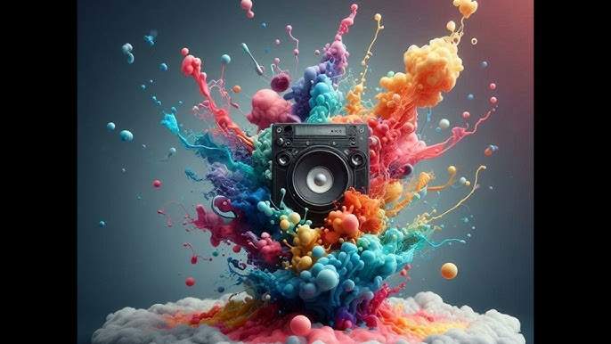

# Bonjour! 
### Ce qui m'intéresse
Je m'appelle Tyler Richard. J'aime mange, j'aime la musique et j'aime bien les animations 2D ainsi que du 3D. Ces deux domaines là sont les deux qui m'intrigue le plus. Sinon, autre que le média, j'aime le sport. Plus spécifiquement le soccer. Avant au secondaire, je jouait au soccer avec mes amis pour le plésir.
J'ai aussi jouer au footsalle aussi durant les périodes de diners. C'était beaucoup plus intense que le soccer extérieur, mais c'est pour ça que c'est encore plus le amusant. 

### Ce que je fais dans mes temps libres

Dans mes temps libres, je suis pianist et chez moi j'ai un piano que j'utilise pour créer des beats. Sinon, je dors ou je serais en train d'écouter des films ou mes animes préférés.

Au début du secondaire, j'étais vraiment dans les animes. J'aimais plus les shonens. Si vous ne savez pas c'est quoi un shonen cliquez ici <https://fr.wikipedia.org/wiki/Sh%C5%8Dnen>
Bref, mon anime préféré pour longtemps c'était Naruto. Surement parce que c'était le premier anime que j'ai regardé dans ma vie et j'ai vraiment aimé. J'ai tellement aimé l'anime que je n'étais pas trop intéressé à en regarder d'autres. Éventuellement, j'ai finis par regarder d'autres animes comme Attack on Titans, My hero academia, Black clover, etc. Je dirais que vraiment les animes m'ont gardés intrigués pendant mes années au secondaire. Maintenant, je n'est pas grand temps pour en écouter. J'ai arrêté éventuellement d'en écouter parce que mon horaire est chargé. Sinon, j'aime faire de l'argent, mais je n'aime pas mon emploi. Vraiment si je pouvais faire de l'argent ailleurs, je serais partis, mais pour maintenant je vais rester et épargner, car je compte commencer mon permis après que j'aille fini avec cette session.

## Merci!!
