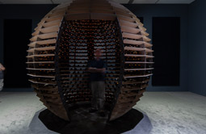

# Conférence Jade Séguela, registraire, Rafael Lozano-Hemmer, Studio Antimodular #
## introduction ##
Le mardi 25 mars 2025, de 12h30 à 14h00, j'ai assisté à une conférence de Jade Séguéla à la Salle Claude Legault. Elle a présenté deux projets de l'artiste Rafael Lozano-Hemmer : Sphere Packing: Bach et Shadow Tuner, et expliqué la logistique de production de ses œuvres, en détaillant les aspects techniques de ses installations interactives, qui utilisent des technologies avancées pour créer des expériences immersives.

## Résumé ##

Rafael Lozano-Hemmer, artiste mexicain né en 1967, mêle technologie, poésie, politique et science dans ses créations. Titulaire d'un bac en sciences chimiques de l’Université Concordia, il privilégie l’interactivité passive (regarder, marcher, respirer) plutôt que l’interactivité active (parler ou appuyer sur des boutons), afin d'encourager une interaction plus subtile avec l’œuvre, comme dans un musée.

Jade Séguéla, responsable de la logistique des œuvres (import/export, emballage, conservation préventive), possède une formation diversifiée. Elle détient un DEC en Arts et Lettres, un Bachelor en Beaux-Arts de l’Université Concordia, et une maîtrise en Muséologie de l’UQAM et de l’Université de Montréal. Spécialisée dans l’art numérique, elle a choisi ce domaine après avoir été frustrée par le manque de reconnaissance des arts numériques au Québec.

## Conclusion ##
En conclusion, j'ai beaucoup apprécié la conférence, découvrir l'art de Rafael Lozano-Hemmer et la complexité de la logistique derrière ses œuvres, car cela m'a permis de comprendre à quel point le parcours artistique est exigeant et fascinant.

 

https://www.lozano-hemmer.com/exhibitions.php
